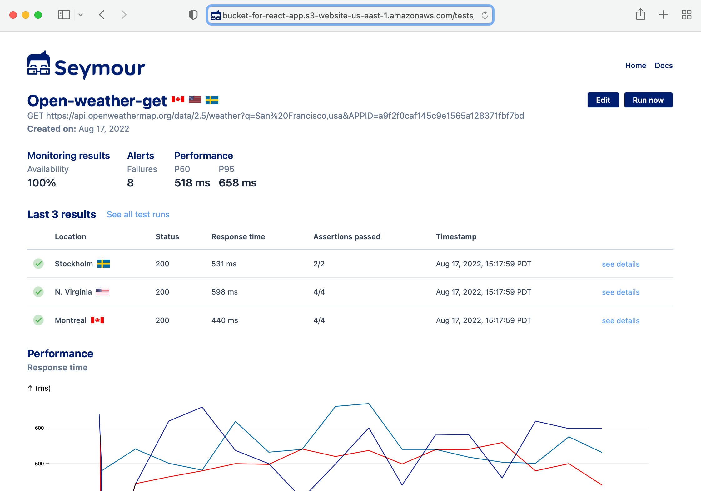

# Seymour
## What is Seymour?

Seymour offers open-source, easy-to-configure active monitoring, allowing users test their API endpoints continuously from globally distributed locations. Seymour measures the availability, response time, and correctness of API endpoint responses. 

## Why we built Seymour

We built Seymour to help engineering teams bolster existing testing approaches and handle the challenges of monitoring their increasingly complex systems. Our solution enables rapid detection of issues in production before users experience them. Seymour's infrastructure is easily deployed on your AWS account with [two CLI commands](https://github.com/seymour-active-monitoring/infra-setup).

## Seymour Components:

1. The [UI](https://github.com/seymour-active-monitoring/tests-ui) provides a simpled, focused interface for configuring tests and viewing test run results
2. The [Backend Service](https://github.com/seymour-active-monitoring/tests-crud) provides APIs for test configuration and test result data
3. [Test Route Packager](https://github.com/seymour-active-monitoring/test-route-packager) is a lambda function responsbile for distributing test configuration data to remote regions
4. [Test Runner](https://github.com/seymour-active-monitoring/test-runner) is a lambda function that executes an API call according to a test configuration and assesses the response
5. [Test Result Writer](https://github.com/seymour-active-monitoring/test-result-writer) is a lambda function that writes test results tot he database. For failed tests, it also triggers the Test Alerts lambda function
6. [Test Alerts](https://github.com/seymour-active-monitoring/test-alerts) is a lambda function responsible for alerting user of failed tests through various channels (email, slack, discord)

## Learn More
Read the [case study](https://seymour-active-monitoring.github.io/seymour-website/) to learn more.

